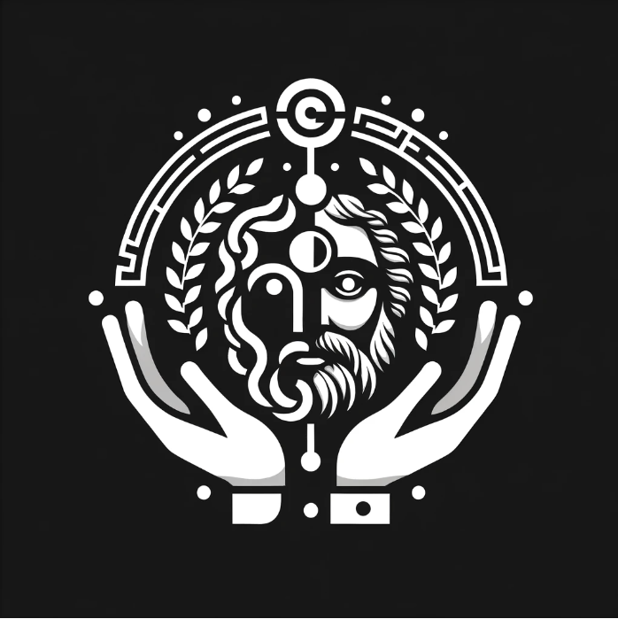

# Socrates

- Socrates は、LLM（大規模言語モデル）を活用した、一対一のディベートバトルアプリです。
- ユーザーはランダムまたは選択されたトピックに基づいて議論を行い、AI がその議論を評価して、より優れた意見を持っていた方をスコア判定します。
- このアプリは議論の楽しさを世に広め、深く語り合える場を提供することを目的としています。

## 特徴

- **トピック**: ユーザーはランダムに提供されるトピック、またはカテゴリーから選んだトピックについて議論することができます。
- **一対一のディベート**: ２人のユーザーが互いの見解を交互に述べ、討論をします。
- **LLM を用いたジャッジ**: AI がその討論を逐一分析し、どちらのユーザーがより優れた論証を展開したかをジャッジします。
- **フィードバックと成長**: ユーザーは AI からのフィードバックをもとに、自身の議論力を見直し、向上させることができます。
- **レーティング(未実装)**: 最強の討論者を決めるために、ユーザーが集まり次第レーティング機能の実装をしたいと考えています。

## 使用技術

- Web App
  - **Backend**
    - FastAPI
  - **Frontend**
    - Next
  - **LLM**
    - gpt-3.5-turbo-16k

## 考え中リスト

- **LLM モデルの選定**

  - 速度面から gpt-3.5-turbo-16k を選んだが、ジャッジの中立性やトピックの自由度を考えると Dolphin 2.6 Mixtral 8x7B などの Uncensored-Models のほうが良いのではないか？

- **運用コストをどう回収するか？**
  - 広告(避けたい)
  - サブスクリプション
  - ポイント買いきり
  - etc...
- **ユーザーが集まるにはどう宣伝をすればいいか？**

## フィードバック

- アプリに関するご意見・ご感想がありましたら遠慮なく X まで DM ください。
