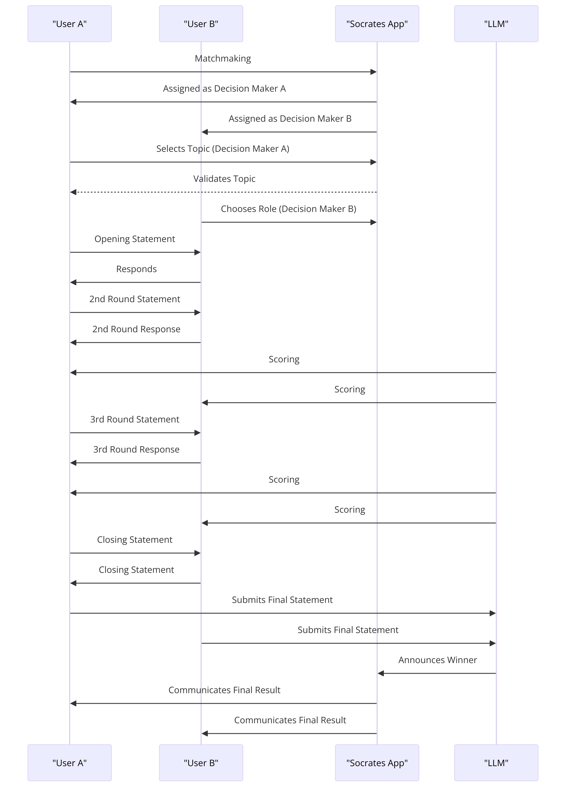

# Socrates

- Socrates は、LLM（大規模言語モデル）を活用した、一対一のディベートバトルアプリです。
- ユーザーはランダムまたは選択されたトピックに基づいて議論を行い、AI がその議論を評価して、より優れた意見を持っていた方をスコア判定します。
- このアプリは議論の楽しさを世に広め、深く語り合える場を提供することを目的としています。

## 特徴

- **トピック**: ユーザーは様々なトピックについて議論することができます。
- **一対一のディベート**: ２人のユーザーが互いの見解を交互に述べ、討論をします。
- **LLM を用いたジャッジ**: AI がその討論を逐一分析し、どちらのユーザーがより優れた論証を展開したかをジャッジします。
- **フィードバックと成長**: ユーザーは AI からのフィードバックをもとに、自身の議論力を見直し、向上させることができます。
- **レーティング(未実装)**: 最強の討論者を決めるために、ユーザーが集まり次第レーティング機能の実装をしたいと考えています。

## ゲームの流れ

### ステップ 1: マッチング

ユーザーはランダムにペアになり、一対一のディベートに参加します。マッチング後、ユーザーは「決定権 A」と「決定権 B」に分かれます。

### ステップ 2: トピック選択（決定権 A）

- **決定権 A** は、提供されたリストからトピックを選択するか、新しいトピックを提案します。
- 提案された新しいトピックは、適切性とディベートの可能性を評価するために LLM によって事前にスクリーニングされます。

### ステップ 3: 役割選択（決定権 B）

- トピックが決定されたら、**決定権 B** は先攻（肯定派）または後攻（否定派）の役割を選択します。

### ステップ 4: オープニングステートメント

- 先攻は賛成の立場からオープニングステートメントを行い、後攻は否定の立場から応答します。各発言は 500 文字以内に制限されます。

### ステップ 5: 2nd Round および 3rd Round

- 各ラウンドでは、参加者は交互に自分の意見を述べ、相手の意見に反論します。各発言は 500 文字以内に制限されます。

### ステップ 6: クロージングステートメント

- ディベートの終わりに、各参加者はクロージングステートメントを行い、自分の主張を最終的にまとめ上げます。

### ステップ 7: LLM による最終結果の発表

- すべての発言とクロージングステートメントが完了した後、LLM は最終的な採点を行い、ディベートの勝者を決定します。

## ルール

- トピックの却下権は 1 回限りです。
- 先攻(肯定派)および後攻(否定派)の役割は、ディベートのバランスを考慮して決定権 B によって選択されます。
- ディベートは公平で尊敬に満ちた環境で行われるべきです。不適切な言動は禁止され,減点対象です。
- 各参加者の発言は 500 文字以内に制限されます。ディベートは合計 8 ターンで構成され、3 ターンの発言機会と 1 ターンのクロージングステートメントを含みます。

## フィードバック

Socrates アプリは、ユーザーからのフィードバックを歓迎します。改善点や新しいアイデアがあれば、アプリ内のフィードバック機能を通じてご連絡ください。

## 使用技術

- **Web App**

  - **Backend**
    - FastAPI
  - **Frontend**
    - Next
    - TypeScript
    - TailwindCSS
  - **LLM**
    - gpt-3.5-turbo-16k

- **Infrastructure**
  - **Google Cloud Run**
  - **Firestore**
  - **Firebase Storage**

## 起動方法

- Frontend

  - $ npm run dev

- Backend
  - $ uvicorn api:app --reload

## 考え中リスト

- **LLM モデルの選定**

  - 速度面から gpt-3.5-turbo-16k を選んだが、ジャッジの中立性やトピックの自由度を考えると Dolphin 2.6 Mixtral 8x7B などの Uncensored-Models のほうが良いのではないか？

- **運用コストをどう回収するか？**
  - 広告(避けたい)
  - サブスクリプション
  - ポイント買いきり
  - etc...
- **ユーザーが集まるにはどう宣伝をすればいいか？**

## フィードバック

- アプリに関するご意見・ご感想がありましたら遠慮なく X まで DM ください。
