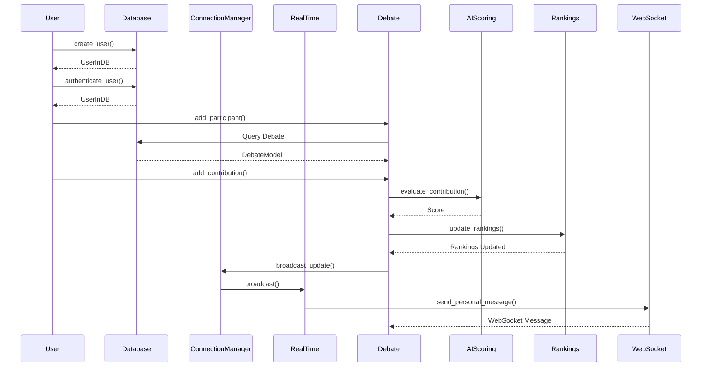

## Code Review All

在审查历史文件时，我注意到了以下几个可能的问题：

1. 在 `realtime.py` 中，`RealTime` 类的 `subscribe` 方法中调用了 `self.manager.send_personal_message` 方法，但是这个方法在 `ConnectionManager` 类中并没有定义。

2. 在 `frontend/pages/profile.tsx` 中，`fetchUserProfile` 函数中的错误处理逻辑使用了 `console.error`，但是在生产环境中，这可能不是处理错误的最佳方式。应该有一种更好的用户反馈机制。

3. 在 `frontend/pages/debate.tsx` 中，`fetchDebateTopic` 和 `fetchUserId` 函数中的错误处理同样使用了 `console.error`，并且在错误情况下没有提供用户反馈。

4. 在 `frontend/components/DebateRoom.tsx` 中，WebSocket 连接在组件卸载时被关闭，但是没有对可能存在的错误进行处理。

5. 在 `user.py` 中，`create_user` 静态方法在创建用户时捕获了所有异常并返回了一个 500 错误，这可能会隐藏潜在的错误类型，应该有更细粒度的异常处理。

6. 在 `rankings.py` 中，`update_rankings` 方法在更新排名时没有对用户的存在性进行检查。

7. 在 `main.py` 中，`Main` 类的 `get_debate` 方法中，如果 `debate_id` 不在 `self.debates` 中，会从数据库查询，但是没有处理数据库查询可能失败的情况。

8. 在 `app.py` 中，`create_user_endpoint` 和 `add_contribution_to_debate` 方法的实现似乎与 `main.py` 中的实现不一致。

9. 在 `auth.py` 中，`get_current_user` 依赖项中的 `User.authenticate_user` 方法调用似乎缺少了密码参数。

10. 在 `debate.py` 中，`Debate` 类的 `broadcast_update` 方法调用了 `self.real_time.broadcast_update`，但是 `RealTime` 类中的 `broadcast_update` 方法需要两个参数，而这里只传递了一个。

11. 在 `ai_scoring.py` 中，`AIScoring` 类的 `evaluate_contribution` 方法中调用了 `evaluate_contribution_text` 和 `preprocess_text`，但是没有提供这些函数的实现或导入。

## Call flow



## Summary

根据历史文件的实现，系统设计了一个在线辩论平台，后端使用 FastAPI 构建，前端使用 Next.js 和 React。系统包括用户认证、实时更新、AI 评分和排名管理等功能。代码中使用了 WebSocket 进行实时通信，并且有一套用户和辩论的数据模型。AI 评分系统用于评估辩论贡献的质量，但具体实现细节不明确。

## TODOs

```python
{
    "realtime.py": "添加缺失的 send_personal_message 方法或者修改调用。",
    "frontend/pages/profile.tsx": "改进错误处理和用户反馈机制。",
    "frontend/pages/debate.tsx": "改进错误处理和用户反馈机制。",
    "frontend/components/DebateRoom.tsx": "处理 WebSocket 断开时可能出现的错误。",
    "user.py": "提供更细粒度的异常处理。",
    "rankings.py": "在更新排名之前检查用户的存在性。",
    "main.py": "处理数据库查询失败的情况。",
    "app.py": "确保与 main.py 中的方法实现一致。",
    "auth.py": "修复 get_current_user 方法中缺少的参数。",
    "debate.py": "修正 broadcast_update 方法的参数。",
    "ai_scoring.py": "提供或导入 evaluate_contribution_text 和 preprocess_text 方法的实现。"
}
```